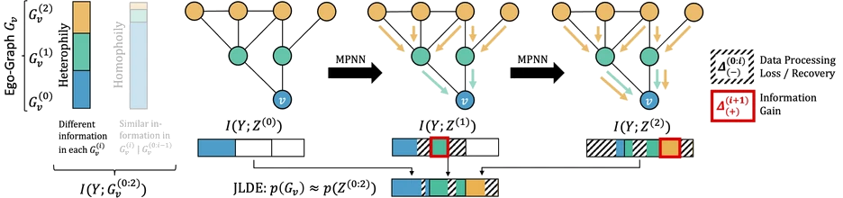

# Joint Latent Density Estimation

This repository provides a lightweight Python wrapper for **Joint Latent Density
Estimation (JLDE)**, the post-hoc uncertainty estimator from:

> Uncertainty Estimation for Heterophilic Graphs Through the Lens of
> Information Theory
>
> Dominik Fuchsgruber, Tom Wollschlaeger, Johannes Bordne, Stephan Guennemann.
> ICML 2025.

The paper studies why uncertainty estimation on graphs behaves differently under
heterophily. Its main practical principle is that a message passing neural
network can encode complementary information in different layers, so epistemic
uncertainty should be estimated on the **joint space of node representations**
rather than on only one final embedding.

This package implements that post-hoc estimator. It does **not** train a GNN or
load graph datasets. You bring hidden states, labels, a training mask, and
optionally logits from your own graph model; `jlde` fits a density estimator on
those representations and returns one confidence score per node.



Paper links:

- arXiv: <https://arxiv.org/abs/2505.22152>
- PDF: <https://arxiv.org/pdf/2505.22152>
- DOI: <https://doi.org/10.48550/arXiv.2505.22152>

## Installation

The package requires Python 3.11 or newer.

On the project machine, use the existing conda environment:

```bash
conda activate jlde
python -m pip install -e .
```

## Quick Example

The estimator expects hidden states that were already produced by a model. Each
hidden state is a tensor with shape `[num_nodes, hidden_dim]`.

```python
import torch

from jlde import JointLatentDensityEstimator

num_nodes = 12
hidden_states = [
    torch.randn(num_nodes, 4),  # e.g. input or early-layer node embeddings
    torch.randn(num_nodes, 6),  # e.g. later-layer node embeddings
]
labels = torch.randint(0, 2, (num_nodes,))
train_mask = torch.arange(num_nodes) < 8

estimator = JointLatentDensityEstimator()

estimator.fit(
    hidden_states=hidden_states,
    labels=labels,
    train_mask=train_mask,
)

confidence = estimator.score_samples(hidden_states)
print(confidence.shape)
print(confidence[:5])
```

`confidence` has shape `[num_nodes]`. With the default nearest-neighbor backend,
larger values mean the node is closer to the fitted training density, while more
negative values indicate lower density and therefore higher epistemic
uncertainty. Scores are not probabilities or calibrated log densities.

## Typical Use With a GNN

```python
from jlde import JointLatentDensityEstimator

# Produced by your own graph model or training pipeline:
# hidden_states: list[torch.Tensor], one tensor per layer, each [num_nodes, dim]
# labels: torch.Tensor, [num_nodes]
# train_mask: torch.BoolTensor, [num_nodes]

estimator = JointLatentDensityEstimator()

estimator.fit(hidden_states, labels, train_mask)
confidence = estimator.predict_confidence(hidden_states)
uncertainty = -confidence
```

## Default Hyperparameters

`JointLatentDensityEstimator()` uses the defaults from the paper-wrapper
implementation:

| Parameter | Default | Meaning |
| --- | --- | --- |
| `density` | `"knn"` | Use the nearest-neighbor density backend. |
| `n_components` | `0.95` | Apply per-layer PCA and retain enough components to explain 95% variance. |
| `k_neighbors` | `5` | Average distances to the five nearest fitted training representations. |
| `layers` | `"all"` | Use every hidden state provided by the caller. |
| `scale_type` | `None` | Do not apply additional per-layer scaling. |
| `use_energy` | `False` | Do not normalize KNN distances by prediction energy. |
| `independent_states` | `False` | Concatenate selected states into one joint latent representation. |

Important details:

- `layers="all"` uses every provided hidden state. You can also pass one index,
  such as `layers=-1`, or a list of indices, such as `layers=[0, -1]`.
- By default, selected hidden states are concatenated into one joint latent
  representation before density scoring. This corresponds to the JLDE principle
  from the paper.
- `independent_states=True` scores selected states separately and sums the
  resulting scores.
- `n_components=None` disables PCA. An integer keeps that many PCA components. A
  float, such as `0.95`, keeps enough components to reach that explained
  variance threshold.
- `k_neighbors` must be less than or equal to the number of training nodes
  selected by `train_mask`.
- If you set `use_energy=True`, pass `logits` to `fit`.
- The built-in KNN scorer stores training labels for compatibility, but the
  current score is not class-conditional.
- PCA and scaling statistics are fit on all provided hidden states, while the
  density backend stores only rows selected by `train_mask`.

## API Overview

### `JointLatentDensityEstimator`

Scikit-learn-style estimator for fitting and scoring latent graph
representations.

```python
estimator = JointLatentDensityEstimator(
    density="knn",
    n_components=0.95,
    k_neighbors=5,
    layers="all",
    scale_type=None,
    use_energy=False,
    independent_states=False,
)

estimator.fit(hidden_states, labels, train_mask, logits=None)
scores = estimator.predict(hidden_states)
scores = estimator.predict_confidence(hidden_states)
scores = estimator.score_samples(hidden_states)
```

### `JointLatentPreprocessor`

Handles hidden-state selection, optional PCA, optional scaling, and joint
concatenation. Use it directly when you want preprocessing without fitting a
density model.

### `NearestNeighborDensity`

KNN density backend used by the estimator. It scores samples by their mean
distance to the `k_neighbors` nearest fitted training representations.

### `PCA`

Small torch-native PCA module used by the preprocessor.

## Configuration Compatibility

Legacy latent post-fit configuration dictionaries can be converted with:

```python
estimator = JointLatentDensityEstimator.from_config(
    {
        "n_components": 0.95,
        "k_neighbors": 5,
        "layers": "all",
        "scale_type": None,
        "use_energy": False,
        "independent_states": False,
    }
)
```

## Citation

If you use this repository, please cite:

```bibtex
@inproceedings{uhitle_icml25,
title = {Uncertainty Estimation for Heterophilic Graphs Through the Lens of Information Theory},
author = {Fuchsgruber, Dominik and Wollschl\"{a}ger, Tom and Bordne, Johannes and G\"{u}nnemann, Stephan},
booktitle = {Proceedings of the 42nd International Conference on Machine Learning (ICML)},
pages = {17928--17959},
year = {2025}
}
```

## License

This project is released under the MIT License. See [LICENSE](LICENSE).
